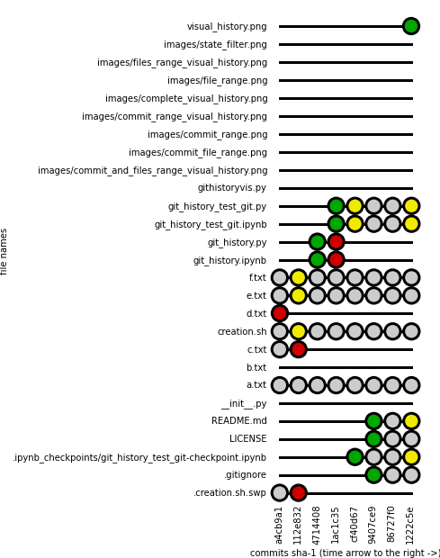
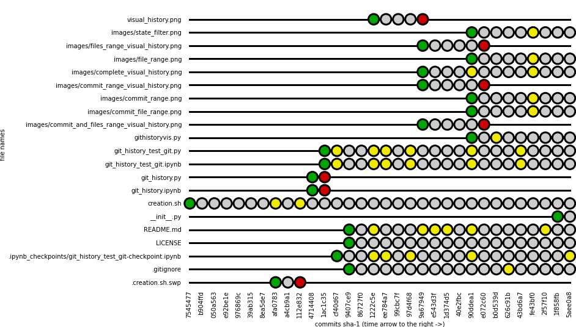
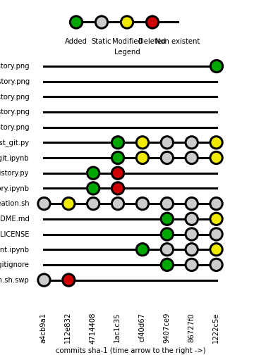
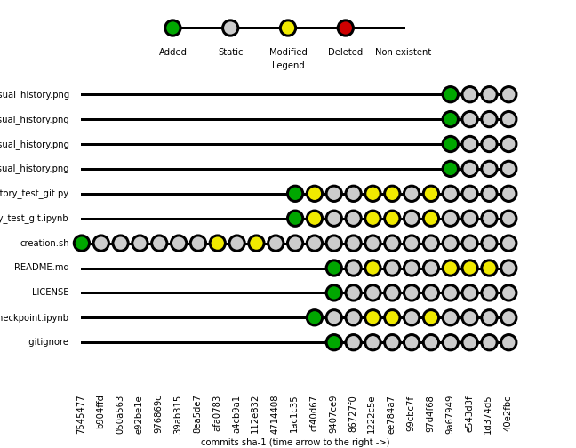

# Git history visualizer

[](https://gitter.im/kidpixo/git_history_visualizer?utm_source=badge&utm_medium=badge&utm_campaign=pr-badge&utm_content=badge)

This script solve this problem:

*I want to visualize the history of all the files in a git repository [in one branch]*

The idea is to extract the whole commits log via the `git` command (you should have it on your machine) and process it to have:

- the list off the file ever existed in this branch
- the list of allsthe commit (at this stage we use the short SHA-1)

# Example

The notebook and the python script included ([git_history_test_git.ipynb](https://github.com/kidpixo/git_history_visualizer/blob/master/git_history_test_git.ipynb) and [git_history_test_git.py](https://github.com/kidpixo/git_history_visualizer/blob/master/git_history_test_git.py)) are just example. 

Change the path at the beginning with your repository path and play with the visualizzation at the end.

This example is on this very repository. The first `*txt` files were only placeholders.

This is the complete visual history of this repository using

```python
plot_history_df(gt.datamatrix,size= 300, figsize = [10,14])
```


This is a commit range, using   using pandas' [Indexing and Selecting Data](http://pandas.pydata.org/pandas-docs/stable/indexing.html) capabilities:

```python
plot_df_commit_range = gt.datamatrix.ix[:,'a4cb9a1':'1222c5e']
plot_history_df(plot_df_commit_range,size= 300, figsize= [3,13])
```



This is a range of files, using

```python
plot_df_file_range = gt.datamatrix[~gt.datamatrix.index.str.contains('txt$')]
plot_history_df(plot_df_file_range,size= 300, figsize= [10,11.5])
```



This is combines the two filters, using

```python
plot_df_commit_file_range = all_filenames.ix[:,'a4cb9a1':'1222c5e']
                            [~all_filenames.index.str.contains('txt$')]
```



This is filter on the all the state in the last commit, using

```python
plot_df_state_filter = gt.datamatrix[gt.datamatrix[gt.datamatrix.columns[-1]] != 'N']
plot_history_df(plot_df_state_filter,size= 300,figsize= [10,10])
```


